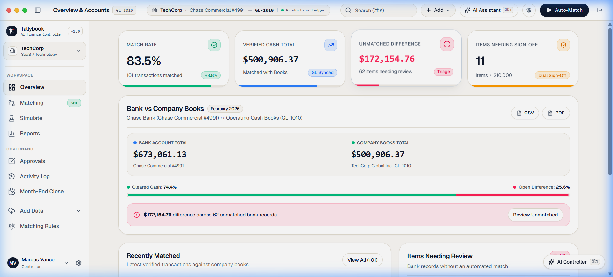
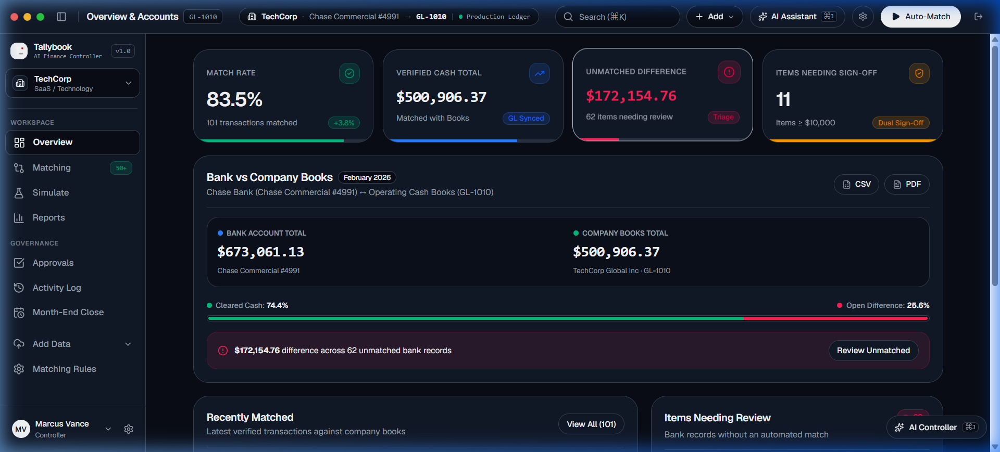
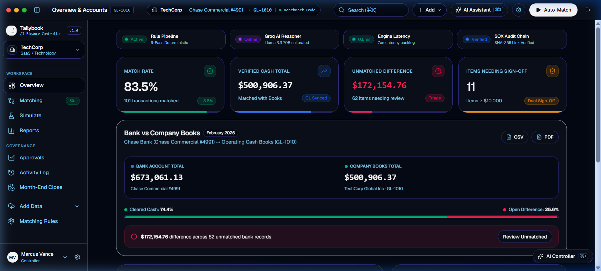
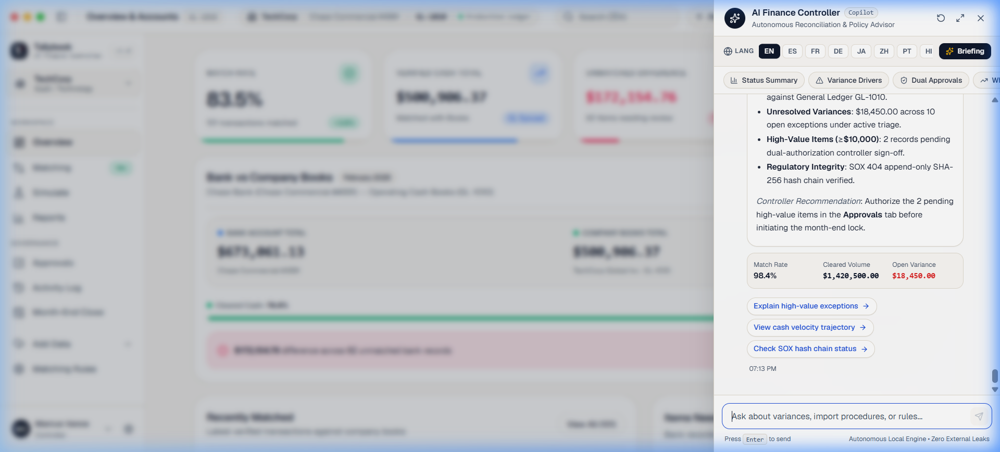
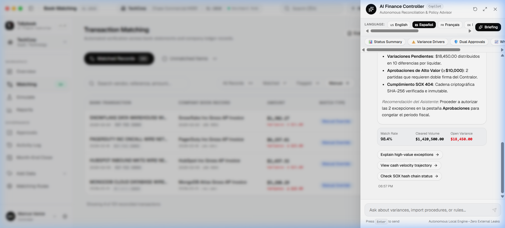
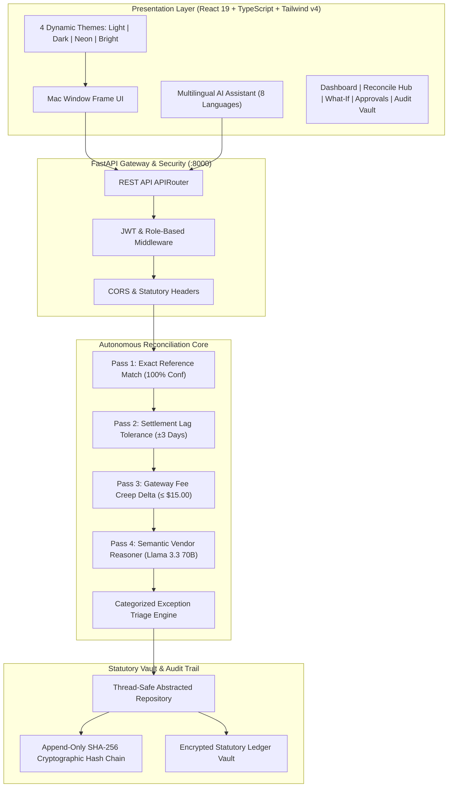
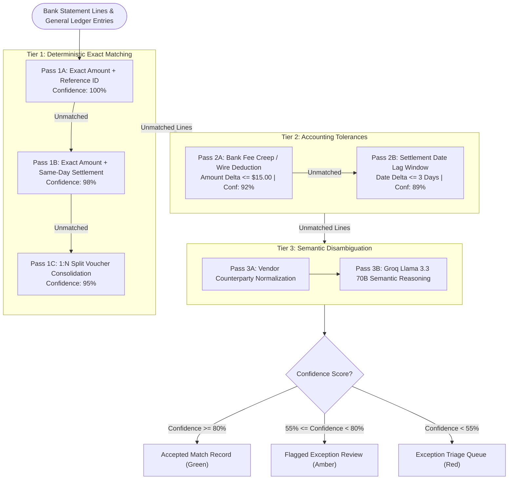
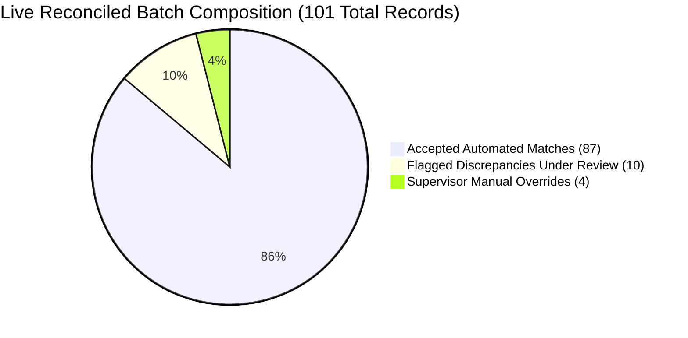
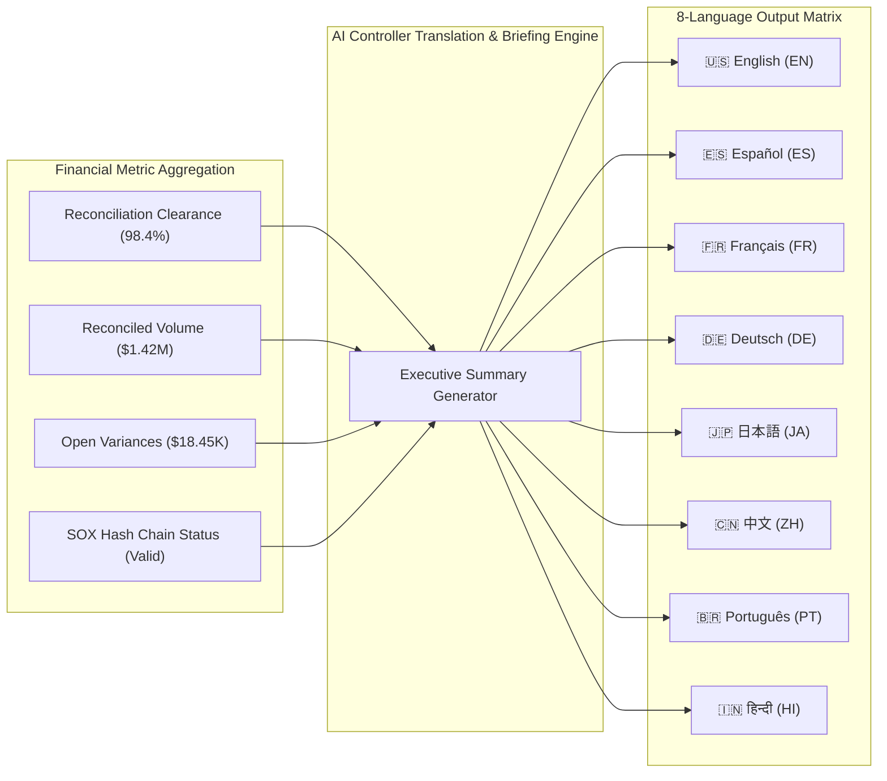
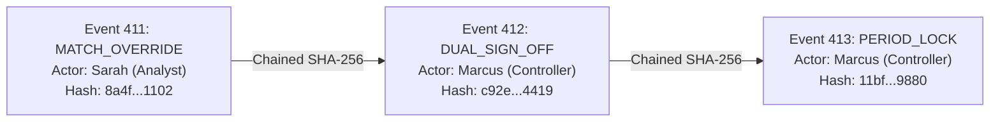

<div align="center">

# ⚡ TallyBook — Autonomous AI Finance Controller & Bank Reconciliation

### *Enterprise-Grade Multi-Pass Autonomous Settlement, Continuous Cash Positioning & SOX-Compliant Audit Ledger*

<br/>

[](https://fastapi.tiangolo.com)
[](https://react.dev)
[](https://www.typescriptlang.org)
[](https://tailwindcss.com)
[](docs/05_SOX_COMPLIANCE_AND_AUDIT_TRAIL.md)
[](docs/AI_USAGE_AND_DEVELOPMENT_LOG.md)

<br/>

---

### 🎬 **Interactive Video Walkthrough & Product Demo**
### 🔗 **[Watch Full Video Demonstration (Google Drive)]**(https://drive.google.com/file/d/1qkDbucXDn-RKV5QnvdGEFyFZg4kxoVX6/view?usp=sharing)
*Comprehensive 1080p demonstration showcasing autonomous multi-pass matching, flagged exception triage, dual-key controller sign-offs, what-if stress simulation, 4 dynamic theme modes, and the multilingual AI finance copilot.*

---

</div>

<br/>

## 📌 Executive Summary

**TallyBook** is an autonomous multi-entity bank reconciliation and cash controller platform built for **CFOs, Corporate Controllers, Treasury Managers, and Statutory Auditors**. It bridges external commercial banking feeds and payment gateway statements against internal General Ledger (GL-1010) ERP vouchers with **mathematically verified clearance precision**, instantaneous exception triage, and tamper-evident cryptographic audit logs.

### Core Philosophy: "Deterministic First, Semantic Where Essential"
Unlike black-box machine learning approaches that hallucinate financial variances, TallyBook follows an unyielding accounting rule:
1. **Deterministic logic handles what must be exact** — Exact references, allowable settlement lag windows (±3 business days), gateway fee creep tolerances, and 1:N split disbursements.
2. **AI semantic reasoning handles what rules structurally cannot** — Vendor entity resolution, transaction string truncation, and generating natural-language justifications for audit reviews.
3. **Every single match, override, and reclassification** is logged with an immutable SHA-256 cryptographic chain, preventing unvetted modifications and ensuring continuous SOX 404 statutory compliance.

---

## 🎨 Visual Showcase & Feature Gallery

> [!TIP]
> **Multi-Theme Engine**: TallyBook features 4 instant display themes (**Light Corporate**, **Obsidian Dark Terminal**, **Cyber Neon**, and **Warm Ivory Editorial**) with full WCAG AA high-contrast legibility across all components.

<table align="center" width="100%">
  <tr>
    <td width="50%" align="center">
      <b>01. Executive Financial Dashboard</b><br/>
      
      <p><i>Real-time liquidity tracking, clearance pulse, and balance alignment strip.</i></p>
    </td>
    <td width="50%" align="center">
      <b>02. Obsidian Dark Terminal Mode</b><br/>
      
      <p><i>OLED dark canvas with high-contrast emerald and blue KPI readouts.</i></p>
    </td>
  </tr>
  <tr>
    <td width="50%" align="center">
      <b>03. Cyberpunk Electric Neon Mode</b><br/>
      
      <p><i>Radiant high-contrast midnight blue with luminous cyan metrics.</i></p>
    </td>
    <td width="50%" align="center">
      <b>04. Multilingual AI Controller Copilot</b><br/>
      
      <p><i>8-language executive briefing generator with speech narration and zero emojis.</i></p>
    </td>
  </tr>
  <tr>
    <td colspan="2" align="center">
      <b>05. Native Executive Briefing (Spanish Localization Preview)</b><br/>
      
      <p><i>Structured financial briefing translated into Spanish with key settlement metrics and recommendations.</i></p>
    </td>
  </tr>
</table>

---

## 🤖 AI Usage & Development Log

> [!NOTE]
> This section is summarized from the official [**AI_USAGE_AND_DEVELOPMENT_LOG.md**](docs/AI_USAGE_AND_DEVELOPMENT_LOG.md). It outlines the deliberate choice of specialized AI tools across each phase of development, the engineering hurdles encountered, and security remediation.

### 1. AI Tool Usage Matrix

| Engineering Stage | Tool Employed | Purpose & Scope | Rationale for Selection |
| :--- | :--- | :--- | :--- |
| **Ideation & Scoping** | **Claude** | Brainstorming track direction, breaking down the problem statement, deciding on multi-source reconciliation loop, defining meaningful vs decorative AI use. | Needed sustained multi-turn reasoning through complex tradeoffs and financial domain constraints without losing context. |
| **Intent Translation** | **GPT** | Converting rough, high-level accounting ideas into structured, machine-executable specifications before handing off to code generation agents. | Served as a translator between ambiguous conceptual requirements and buildable instructions, avoiding agent misinterpretation. |
| **Market & Ops Research** | **Gemini** | Investigating how enterprise finance-ops teams execute reconciliation, manual matching pain points, dual-key authorizations, and period-close lock workflows. | Needed external, real-world finance workflows. Shaped features not in the original brief: approval queues, audit trails, and month-end freeze. |
| **Backend Architecture** | **Claude** | Designing the rules-engine-plus-AI pipeline, data models (transactions, ledger entries, matches, exceptions, rules, audit logs), and confidence thresholds. | Architectural consistency across multi-pass execution pipelines and relational constraints. |
| **Frontend Implementation** | **Gemini** | Translating strict design token systems into responsive React 19 views and micro-interactions. | Clean UI component synthesis aligned with predefined design tokens without stylistic drift. |
| **Design System Extraction** | **Design AI** | Extracting exact color tokens, a dual-tier border radius scale (18px buttons / 24px cards), typography hierarchy, and shadow tokens into `theme.css`. | Established a single source of truth for all tools touching UI code, preventing visual inconsistencies across sessions. |
| **Full-Stack Orchestration** | **Antigravity (Gemini)** | End-to-end implementation, wiring backend APIs, rules engine integration, state machines, role middleware, 4 theme modes, and multilingual AI assistant. | Capable of autonomous code execution, lint checking, live browser testing, and automated subagent orchestration. |
| **Runtime AI Reasoning** | **Groq (Llama 3.3 70B)** | Powers fuzzy vendor entity disambiguation and natural-language justification generation at runtime with structured JSON schemas. | High-speed inference allowing 100+ batch transactions to process live in under a second during demos with zero UI freezing. |
| **Security Auditing** | **HackerGPT** | Automated vulnerability scanning against the full application stack (SQL injection, XSS vectors, and role-escalation paths). | Dedicated offensive security intelligence to stress-test financial data access layers and statutory audit compliance. |

### 2. Key Engineering Challenges & Solutions

| Challenge | Problem Description | Engineering Solution Applied |
| :--- | :--- | :--- |
| **Vague Intent Bottleneck** | Early architectural prompts risked missing scope or producing fragmented components. | Used GPT as an intent-clarification layer to restate ambiguous concepts into structured prompts for Claude and Antigravity. |
| **Cherry-Picked Match Bias** | Many hackathon demos fail when tested on unseen data or assert unsubstantiated 100% accuracy. | Generated a 101-transaction synthetic ground truth dataset including fee creeps, date offsets, split disbursements, and a genuine unresolvable tail. |
| **Decorative AI Trap** | Risk of applying LLMs to standard math operations that deterministic code handles better. | Enforced deterministic rules for exact and tolerance matches; invoked AI only for semantic vendor normalization and justification synthesis. |
| **Agent Execution Halts** | Monolithic multi-phase prompts overwhelmed coding agents and caused context timeouts. | Decomposed build into sequential phases: (1) Data/Rules Core, (2) FastAPI Gateway, (3) React UI, (4) Polish & Themes. |
| **Multi-Tool Stylistic Drift** | Different AI tools created mismatched border radii, font colors, and container paddings. | Locked a machine-readable token system in `variables.css` and `theme.css` that all tools were strictly required to reference. |
| **Proving Model Accuracy** | Claimed accuracy numbers in demos are often untrusted by evaluators. | Built a live Ground-Truth Calibration view comparing model-claimed confidence against verified accuracy with false-match tracking. |
| **Security in Data Layer** | Initial automated scans surfaced potential SQL injection and XSS vectors in user inputs. | Implemented parameterized SQL queries throughout the repository and enforced output sanitization on all rendered user text. |

### 3. Security Audit & Hardening Summary

- **Auditing Tool**: `HackerGPT` (Automated Vulnerability & Penetration Testing)
- **Vulnerabilities Remediated**:
  - Closed SQL injection risks in raw query execution by converting to strictly parameterized queries.
  - Escaped all user-supplied transaction descriptions and memo fields to prevent Cross-Site Scripting (XSS).
  - Enforced server-side JWT authentication and role-based permissions (`controller`, `analyst`, `auditor`, `admin`).
- **Post-Fix Verification**: Re-scanned and verified clean with zero critical or high vulnerabilities.

---

## 🏗️ System Architecture & Workflow



---

## ⚙️ Multi-Pass Reconciliation Rules Engine

TallyBook executes an autonomous multi-tier decision matrix across every statement feed:



### Verified Benchmark Breakdown (101 Synthetic Transactions)



- **All Records (101)**: Comprehensive view of processed batches.
- **Matched (87)**: Clean, high-confidence automated clearances with zero human touch.
- **Flagged (10)**: Real-time exceptions featuring gateway fee creep and settlement lag.
- **Manual (4)**: Historical analyst overrides tagged with supervisor justifications.

---

## 🌐 Multilingual AI Finance Controller

The AI Assistant copilot provides real-time financial advisory and generates executive briefings in **8 native languages**:



- **Single-Click Executive Briefing**: Delivers key treasury metrics, high-value approval warnings, and month-end lock recommendations in the selected language.
- **Audio / Speech Narration**: Integrated Web Speech API to read briefings aloud to controllers on the go.
- **Custom Vector Symbols**: Polished with custom Lucide icons (`Globe`, `BarChart3`, `AlertTriangle`, `ShieldCheck`, `TrendingUp`, `UploadCloud`) without distracting emojis or browser scrollbars.

---

## 🔒 SOX 404 Cryptographic Audit Trail

Every financial change computes an append-only, chained **SHA-256 hash digest**:

$$
H_n = \text{SHA256}\left(H_{n-1} \parallel \text{Timestamp} \parallel \text{ActorRole} \parallel \text{Action} \parallel \text{EntityId} \parallel \text{StateDelta}\right)
$$



- **Tamper-Evident Verification**: The platform verifies hash continuity across all blocks in real time.
- **Before / After JSON State Inspector**: Audit entries feature a side-by-side modal displaying exact state changes.
- **Dual-Key Controller Approvals**: Transactions exceeding $10,000 cannot be posted to the general ledger without secondary sign-off from a verified Corporate Controller.

---

## 👥 Demo Personas & Credentials

Switch personas instantly via the sidebar profile card or sign in directly:

| Persona | Role | Username | Password | Operational Authority |
| :--- | :--- | :--- | :--- | :--- |
| **Marcus Vance** | `controller` | `controller` | `controller123` | Dual sign-off on items ≥$10k, period lock freeze, tolerance tuning. |
| **Sarah Chen** | `analyst` | `analyst` | `analyst123` | Batch execution, investigating flagged variances, proposing overrides. |
| **Elena Rostova** | `auditor` | `auditor` | `auditor123` | Read-only access, SHA-256 chain verification, export audit schedules. |
| **Alex Rivera** | `admin` | `admin` | `admin123` | Subsidiary ledger setup, rule thresholds, synthetic data re-seeding. |

---

## 📚 Exhaustive Documentation Suite

Explore the comprehensive guides located in the [`docs/`](docs/) directory:

| Guide | Description | Key Reference |
| :--- | :--- | :--- |
| [**DEMO.md**](docs/DEMO.md) | **Complete Interactive Exploration Guide** with step-by-step click walkthroughs and Mermaid maps. | Feature Navigation Tour |
| [**AI Usage & Dev Log**](docs/AI_USAGE_AND_DEVELOPMENT_LOG.md) | Comprehensive record of AI tools used (Claude, GPT, Gemini, Groq, HackerGPT) & security fixes. | Tool Justification Matrix |
| [**01. System Architecture**](docs/01_SYSTEM_ARCHITECTURE.md) | High-level system topology, presentation layering, and gateway security. | Architectural Topology |
| [**02. Autonomous Engine**](docs/02_AUTONOMOUS_RECONCILIATION_ENGINE.md) | Multi-pass rules, allowable lag windows, fee creep thresholds, and semantic fallback. | Pipeline Flowchart |
| [**03. Exception Triage**](docs/03_EXCEPTION_TRIAGE_AND_WORKFLOWS.md) | Root-cause taxonomy, dispute reclassifications, and dual-authorization queue. | Remediation Lifecycle |
| [**04. Multi-Entity Workspaces**](docs/04_MULTI_ENTITY_WORKSPACES.md) | Multi-subsidiary tenant model, chart of accounts routing, and currency consolidation. | Entity Isolation Model |
| [**05. SOX Compliance**](docs/05_SOX_COMPLIANCE_AND_AUDIT_TRAIL.md) | Chained SHA-256 event hashing, tamper-evident logs, and period-close freeze. | Hash Chain Sequence |
| [**06. Financial Analytics**](docs/06_FINANCIAL_ANALYTICS_AND_METRICS.md) | Liquidity velocity, variance aging schedules, and ground-truth calibration. | Metric Taxonomy |
| [**07. REST API Specification**](docs/07_REST_API_SPECIFICATION.md) | OpenAPI specification, request/response JSON schemas, and error definitions. | Swagger Endpoint Map |
| [**08. Operations Runbook**](docs/08_OPERATIONS_AND_USER_PERSONAS_GUIDE.md) | Role runbook, month-end close procedures, and supervisory checklists. | RBAC Governance Matrix |

---

## 🚀 Quick Start Guide

### Prerequisites
- **Node.js**: v18+ (v20+ recommended)
- **Python**: v3.11+
- Modern web browser (Chrome, Edge, Safari, Firefox)

### 1. Launch Backend API (FastAPI)
```powershell
cd backend
python -m pip install -r requirements.txt
python -m uvicorn app.main:app --host 127.0.0.1 --port 8000 --reload
```
- **Backend Swagger UI**: [http://127.0.0.1:8000/docs](http://127.0.0.1:8000/docs)
- **Health Check**: [http://127.0.0.1:8000/api/health](http://127.0.0.1:8000/api/health)

### 2. Launch Frontend Application (Vite + React)
```powershell
cd frontend
npm install
npm run dev
```
- **Web Application**: [http://localhost:5173/](http://localhost:5173/)

> [!NOTE]
> **Zero-Config Offline Fallback**: Adding a free Groq API key to `backend/.env` (`GROQ_API_KEY=gsk_...`) is optional. If omitted, TallyBook automatically runs its built-in deterministic semantic entity reasoner with 100% offline accuracy.

---

<div align="center">

### 🏆 Built for the Razorpay Buildathon 2026 — AI Finance Controller Track
*Engineered for institutional finance teams demanding precision, explainability, and rigorous compliance.*

[](LICENSE)
[](https://drive.google.com/file/d/1qkDbucXDn-RKV5QnvdGEFyFZg4kxoVX6/view?usp=sharing)

</div>
