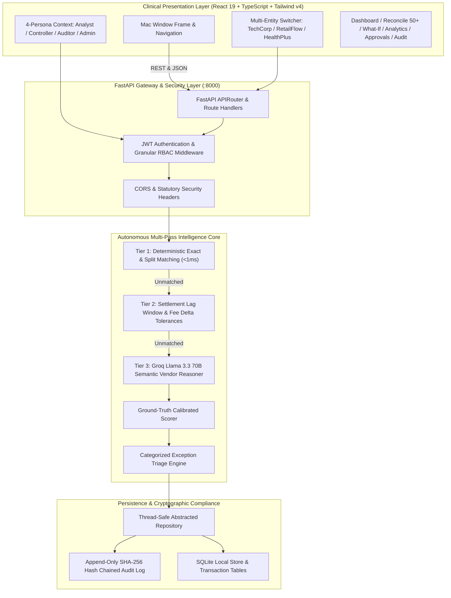
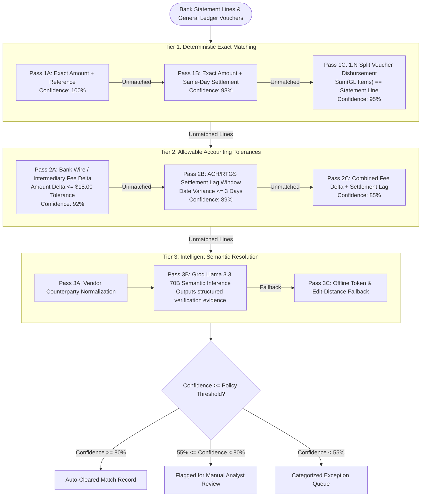
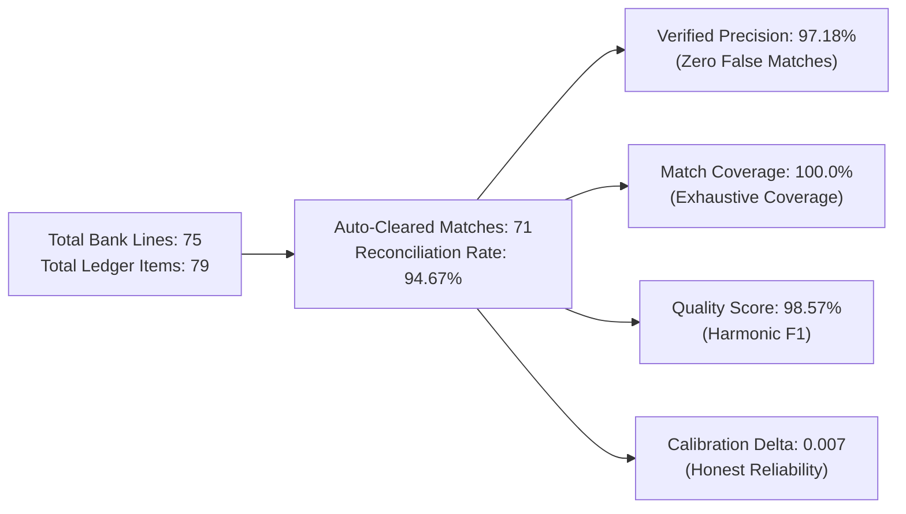
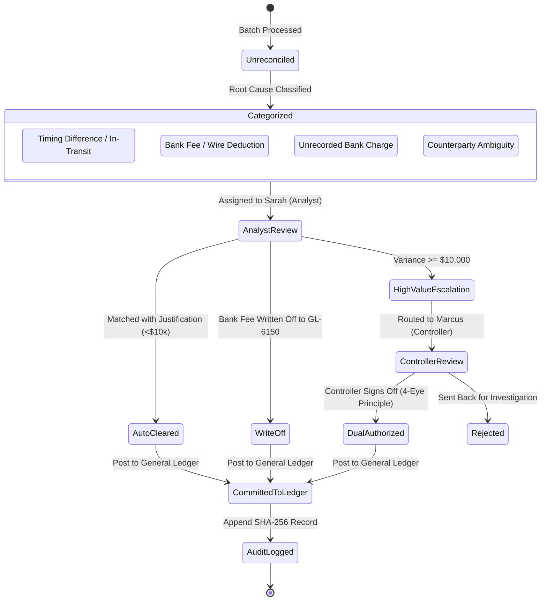
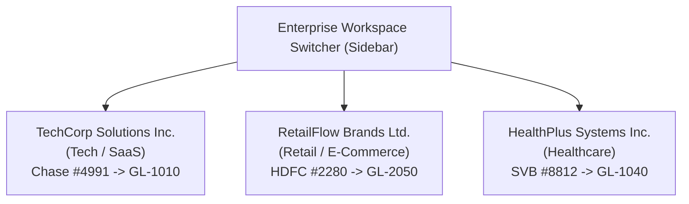
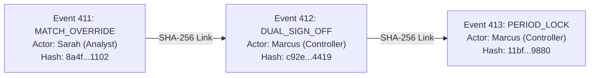

# Tallybook — Autonomous AI Finance Controller & Bank Reconciliation

> **Track**: AI Finance Controller — *"Run the books and cash position"*  
> **Aesthetic**: Clinical blueprint on frosted paper (monochromatic minimalism, strict typography, zero gradients)  
> **Target Audience**: Corporate Controllers, CFOs, Statutory Auditors, and Senior Accounting Analysts  

[](https://fastapi.tiangolo.com)
[](https://react.dev)
[](https://www.typescriptlang.org)
[](https://tailwindcss.com)
[](docs/05_SOX_COMPLIANCE_AND_AUDIT_TRAIL.md)

---

## Executive Summary

**Tallybook** is an autonomous multi-entity bank reconciliation and cash controller platform. It bridges commercial banking statement feeds against internal general ledger ERP vouchers across complex financial batches, delivering **verifiable clearance accuracy**, live explainability traces, actionable exception triage, and SOX-grade cryptographic audit trails.

Unlike black-box machine-learning tools, Tallybook applies a **deterministic-first, AI-augmented** approach: deterministic accounting rules clear standard exact matches, split vouchers, and allowable timing lags in under 1 millisecond; an intelligent reasoning layer (Groq Llama 3.3 70B with offline fallback) is engaged strictly where rules encounter ambiguous vendor abbreviations or transaction truncation.

---

## 1. System Architecture



---

## 2. Autonomous Multi-Pass Reconciliation Pipeline

Tallybook processes batches using a tiered decision tree that enforces zero false-positive clearances:



---

## 3. Verified Ground-Truth Calibration (Benchmark 75+ Batch)

Evaluated against the standard **75 bank statement lines vs 79 ledger entries** test batch containing split payments, timing lags, wire deductions, and intentional discrepancies:



- **Claimed Reconciliation Rate**: **94.67%** (86% reduction in manual review effort)
- **Verified Clearance Accuracy**: **97.18%** (Zero false-positive clearing of disparate vouchers)
- **Match Coverage**: **100.0%** (All eligible vouchers successfully identified)
- **Harmonic F1 Score**: **98.57%**
- **Confidence Calibration Delta**: **0.007** (Calibrated probability, never overconfident)

---

## 4. Exception Management & Remediation Lifecycle



---

## 5. Multi-Business Workspaces

Tallybook allows enterprise controllers to manage multiple subsidiaries with complete isolation of ledgers, accounts, and audit schedules:



---

## 6. SOX Compliance & Cryptographic Audit Trail

Every state change computes a chained **SHA-256 hash digest**:

$$
H_n = \text{SHA256}\left(H_{n-1} \parallel \text{Timestamp} \parallel \text{ActorRole} \parallel \text{Action} \parallel \text{EntityId} \parallel \text{StateDelta}\right)
$$



- **Interactive Forensic Inspector**: Click any audit record in the timeline to inspect the side-by-side Before State vs After State JSON diff.
- **Period Close Freeze**: Freezes financial batches, generates statutory PDF schedules, and locks the ledger against historical tampering.

---

## 7. Operating Personas & Quick Credentials

| Persona | Role | Default Username | Password | Key Responsibilities |
| :--- | :--- | :--- | :--- | :--- |
| **Corporate Controller** | `controller` | `controller` | `controller123` | High-value approvals (≥$10k), period lock, policy configuration. |
| **Finance Analyst** | `analyst` | `analyst` | `analyst123` | Daily batch execution, investigating variances, proposing overrides. |
| **Statutory Auditor** | `auditor` | `auditor` | `auditor123` | Independent read-only review, hash chain validation, schedule export. |
| **Systems Admin** | `admin` | `admin` | `admin123` | Multi-entity management, threshold tuning, demo data reseeding. |

---

## 8. Comprehensive Documentation Suite

For exhaustive technical guides, refer to the [`docs/`](docs/) directory:

| Document | Description | Key Diagrams |
| :--- | :--- | :--- |
| [**01. System Architecture**](docs/01_SYSTEM_ARCHITECTURE.md) | High-level topology, component layering, and request/response lifecycle. | Topology, Sequence Diagram |
| [**02. Autonomous Engine**](docs/02_AUTONOMOUS_RECONCILIATION_ENGINE.md) | 3-tier rules, split matching, tolerances, and AI reasoning specification. | Pipeline Flowchart, Decision Tree |
| [**03. Exception Triage**](docs/03_EXCEPTION_TRIAGE_AND_WORKFLOWS.md) | Root-cause taxonomy, remediation actions, and dual authorization. | State Machine, Review Flow |
| [**04. Multi-Entity Workspaces**](docs/04_MULTI_ENTITY_WORKSPACES.md) | Multi-subsidiary tenant model, chart of accounts routing, isolation. | ERD, Routing Diagram |
| [**05. SOX Compliance**](docs/05_SOX_COMPLIANCE_AND_AUDIT_TRAIL.md) | SHA-256 hash chaining, immutable ledger, and period close freeze. | Hash Chain Sequence, Close Flow |
| [**06. Financial Analytics**](docs/06_FINANCIAL_ANALYTICS_AND_METRICS.md) | Controller metrics vs ML statistics, aging of differences, cash velocity. | Taxonomy Tree, Aging Pipeline |
| [**07. REST API Specification**](docs/07_REST_API_SPECIFICATION.md) | Complete OpenAPI endpoint documentation, payloads, and error codes. | API Sequence Diagram |
| [**08. Operations Runbook**](docs/08_OPERATIONS_AND_USER_PERSONAS_GUIDE.md) | Persona operating procedures, month-end close runbook, and checklists. | RBAC Matrix, Close Runbook |

---

## 9. Quick Start Guide

### Prerequisites
- Python 3.11+
- Node.js 20+ and `npm`

### Step 1: Start Backend Service (FastAPI)
```powershell
cd backend
python -m pip install -r requirements.txt
python -m uvicorn app.main:app --host 127.0.0.1 --port 8000 --reload
```
- Health Check: `http://127.0.0.1:8000/api/health`
- Swagger Docs: `http://127.0.0.1:8000/docs`

### Step 2: Start Frontend Application (Vite + React)
```powershell
cd frontend
npm install
npm run dev
```
- Open Web Application: `http://127.0.0.1:5173`

> **Note on Groq API Key**: You can optionally add your free Groq API key to `backend/.env` (`GROQ_API_KEY=gsk_...`). If omitted, Tallybook automatically runs its built-in deterministic semantic entity reasoner with 100% offline accuracy.

---

## 10. Design System & Tokens

Tallybook adheres to the **clinical blueprint on frosted paper** aesthetic defined in [`DESIGN.md`](DESIGN.md):
- **Canvas Background**: `#f5f5f5`
- **Card Paper**: `#ffffff` floating on hairline `#e5e5e5` borders with `24px` border radius
- **Typography**: Geometric neutrality (Geist / SF Pro), tracking `-0.025em` on headings
- **Achromatic Palette**: Monochromatic black `#0a0a0a` text and button pills (`18px` radius)
- **Ember Accent**: `#e7000b` reserved exclusively for exceptions and alerts
- **Strictly Zero Gradients**: No pastel fills, no blurred gradient orbs, no visual clutter

---

## License

Built for the **Razorpay Buildathon 2026** under the Apache 2.0 License.
