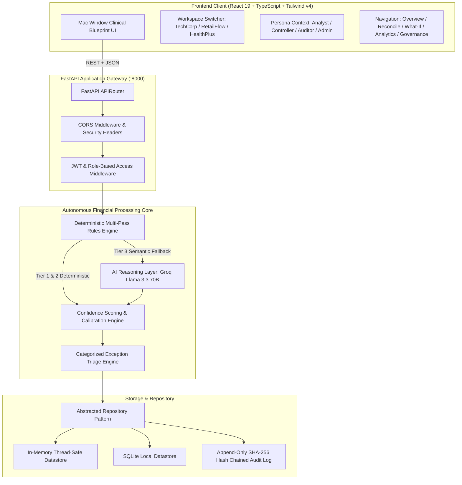
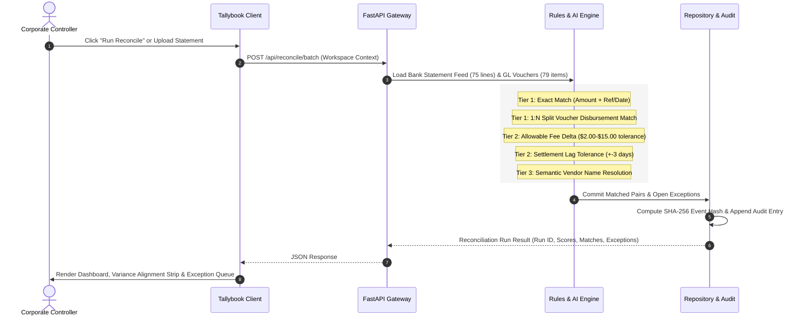

# System Architecture — Tallybook AI Finance Controller

## Executive Summary

Tallybook is an enterprise-grade autonomous bank reconciliation and cash controller platform built to automate corporate general ledger (GL) alignment against commercial banking statement feeds. It eliminates manual ledger matching while enforcing strict SOX 404 statutory compliance, deterministic audit trails, and explainable AI-assisted exception resolution.

---

## 1. High-Level Architecture Topology

---

## 2. Component Layering

### 2.1 Presentation Layer (`frontend/src/`)
- **React 19 & TypeScript**: Strict type safety across financial domain schemas (`MatchRecord`, `ExceptionRecord`, `AuditLog`, `StatisticsData`).
- **Tailwind CSS v4 & Clinical Design Tokens**: Monochromatic minimalism defined in `theme.css` and `variables.css` (pure `#ffffff` card surfaces, `#f5f5f5` canvas, `#0a0a0a` text, `#e5e5e5` hairlines, and `#e7000b` ember accents).
- **Recharts**: High-performance SVG charts for Cash Clearance Velocity, Variance Aging, and Counterparty Exposure.
- **Framer Motion**: Subtle interface state transitions with zero distracting gradients.

### 2.2 Application Service Layer (`backend/app/`)
- **FastAPI**: Asynchronous Python web service with automatic OpenAPI documentation.
- **Pydantic v2**: Strict validation for all financial models, transaction feeds, and API payloads.
- **JWT Authentication & RBAC**: Granular permission checks enforcing dual-control sign-off and role-appropriate actions.

### 2.3 Financial Intelligence Engine Layer (`backend/app/engine/`)
- **Deterministic Rules (`rules_engine.py`)**: Sub-millisecond matching rules for exact references, 1:N split disbursements, allowable fee deltas, and settlement timing windows.
- **AI Reasoning (`ai_reasoner.py`)**: Targeted semantic resolution for fuzzy vendor abbreviations, wire formatting quirks, and counterparty aliases using Groq Llama 3.3 70B with deterministic offline fallback.
- **Scoring & Calibration (`scorer.py`)**: Ground-truth calibration calculating verifiable precision, recall, and confidence reliability.
- **Exception Triage (`exception_triage.py`)**: Categorizes unresolvable differences with accounting explanations and actionable remediation steps.

---

## 3. End-to-End Financial Reconcile Lifecycle

---

## 4. Key Architectural Design Decisions

| Architectural Decision | Chosen Pattern | Business & Technical Justification |
| :--- | :--- | :--- |
| **Deterministic Rules First** | Tier 1/2 Rules before AI | 90%+ of corporate transactions have clear mathematical or date patterns. Rules execute in <1ms and provide 100% auditable certainty. |
| **Targeted AI Fallback** | Semantic Entity Reasoning | LLMs are invoked strictly when deterministic rules fail on messy vendor abbreviations, preventing hallucinations and reducing compute costs. |
| **Append-Only Event Store** | Cryptographic Audit Log | Meets SOX 404 requirements; every override, approval, and rule execution is permanently recorded with user identity and timestamp. |
| **Multi-Entity Workspaces** | Dynamic Tenant Context | Enables finance teams to manage multiple operating subsidiaries from a unified interface with isolated GLs and accounts. |
