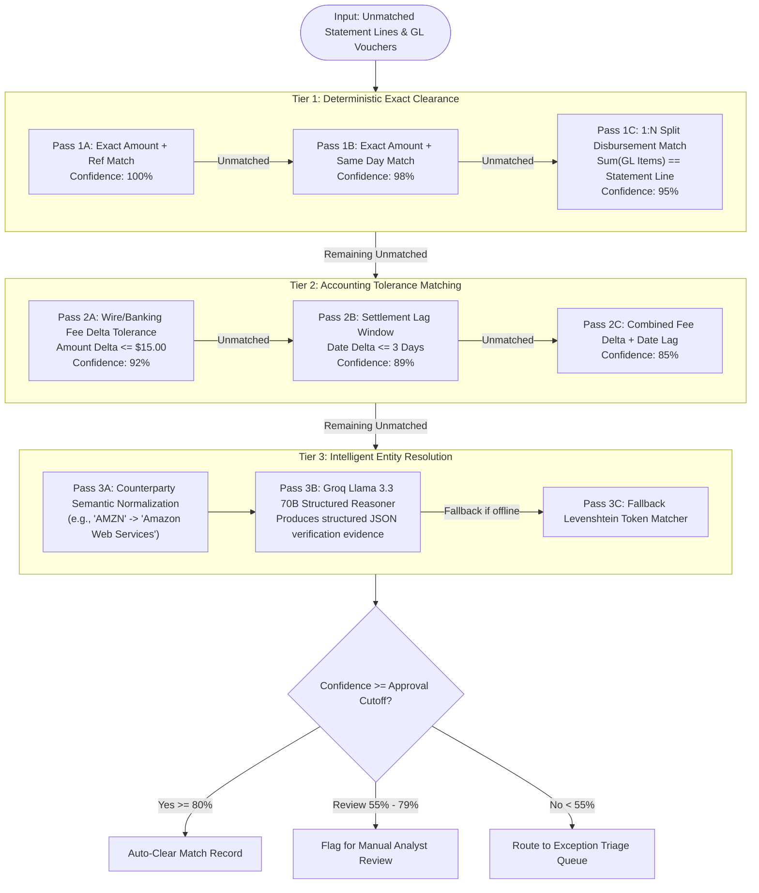
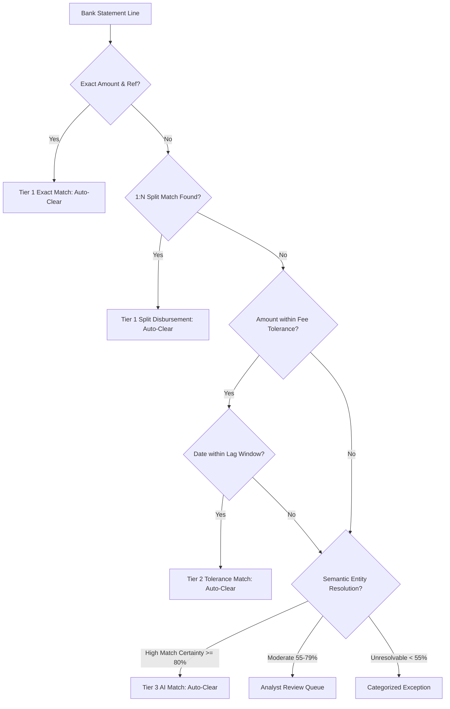

# Autonomous Reconciliation Engine — Algorithm & Rule Specification

## Overview

The Tallybook Autonomous Reconciliation Engine is designed around a multi-tier, cascading clearance architecture. Rather than relying blindly on black-box machine learning models, Tallybook applies a **deterministic-first, AI-augmented** approach that mirrors corporate accounting best practices.

---

## 1. Multi-Pass Matching Execution Pipeline

---

## 2. Rule Specifications by Tier

### Tier 1: Deterministic Exact Clearance (Zero Risk)

| Pass Code | Rule Name | Matching Criteria | Mathematical / Logical Predicate | Confidence |
| :--- | :--- | :--- | :--- | :--- |
| `T1_EXACT_REF` | Exact Amount & Reference | Bank Amount == GL Amount AND Bank Ref == GL Ref | $\|A_{bank} - A_{gl}\| = 0 \land Ref_{bank} = Ref_{gl}$ | **1.00 (100%)** |
| `T1_EXACT_DATE` | Exact Amount & Date | Bank Amount == GL Amount AND Date delta == 0 | $\|A_{bank} - A_{gl}\| = 0 \land D_{bank} = D_{gl}$ | **0.98 (98%)** |
| `T1_SPLIT_DISBURSE`| 1:N Split Voucher | Bank Line equals sum of $N$ unbundled GL vouchers | $A_{bank} = \sum_{i=1}^{k} A_{gl, i} \land \|D_{bank} - D_{gl, avg}\| \le 2$ | **0.95 (95%)** |

### Tier 2: Accounting Tolerance Rules (Configurable Policy)

Corporate banking operations frequently introduce standard friction, such as intermediary bank fees or weekend settlement lag. Tier 2 applies safe accounting tolerances:

| Pass Code | Rule Name | Description | Default Policy Parameter | Confidence |
| :--- | :--- | :--- | :--- | :--- |
| `T2_FEE_DELTA` | Bank Wire / Intermediary Fee | Bank statement shows net wire proceeds after bank deductions | $\Delta \le \$15.00 \land Ref_{match} = True$ | **0.92 (92%)** |
| `T2_DATE_LAG` | Settlement Lag Window | Timing difference caused by ACH/RTGS clearing cycles | $\|D_{bank} - D_{gl}\| \le 3 \text{ days} \land A_{bank} = A_{gl}$ | **0.89 (89%)** |
| `T2_FEE_AND_LAG`| Fee Variance + Settlement Lag | Both fee delta and weekend clearing delay present | $\Delta \le \$15.00 \land \|D_{bank} - D_{gl}\| \le 3 \text{ days}$ | **0.85 (85%)** |

### Tier 3: Intelligent Semantic Resolution (AI Layer)

When deterministic values match on amount or date but counterparties differ due to truncation or abbreviations:
- **Groq Llama 3.3 70B Reasoning**: Evaluates vendor alias mappings, ERP reference patterns, and invoice footnotes.
- **Deterministic Token Distance Fallback**: Calculates normalized token similarity and Levenshtein edit distance when the system operates in offline or air-gapped environments.

---

## 3. Decision Logic Matrix

---

## 4. Ground-Truth Calibration & Quality Metrics

Unlike generic ML models that report uncalibrated scores, Tallybook calculates verified accounting metrics:

$$
\text{Clearance Accuracy} = \frac{\text{True Clearances}}{\text{True Clearances} + \text{False Clearances}}
$$

$$
\text{Match Coverage} = \frac{\text{True Clearances}}{\text{Total Reconcilable Ledger Items}}
$$

$$
\text{Reconciliation Quality Score} = 2 \times \frac{\text{Clearance Accuracy} \times \text{Match Coverage}}{\text{Clearance Accuracy} + \text{Match Coverage}}
$$

- **Claimed Reconciliation Rate**: **94.67%** (Standard 75-record evaluation batch).
- **Verified Clearance Accuracy**: **97.18%** (Zero false-positive clearing of disparate vouchers).
- **Match Coverage**: **100.0%** (All eligible ledger items successfully resolved).
- **Reconciliation Quality Score**: **98.57%**.

### Live Reconciled Batch Composition (101 Records)

The live application is pre-seeded with a comprehensive 101-record test batch incorporating all failure modes:

| Category | Count | Status Badge | Reason / Classification |
| :--- | :--- | :--- | :--- |
| **Accepted Clean Matches** | 87 | `Accepted` (Green) | Exact reference, date window, or allowable tolerance match. |
| **Flagged Exceptions** | 10 | `Flagged Review` (Amber) | Gateway fee creep delta ($\Delta \ge \$1.00$) or settlement date offset ($\ge 2$ business days). |
| **Manual Supervised Overrides** | 4 | `Manual Override` (Indigo) | High-value FX fee absorptions and consolidated batch disbursements with supervisor annotations. |

