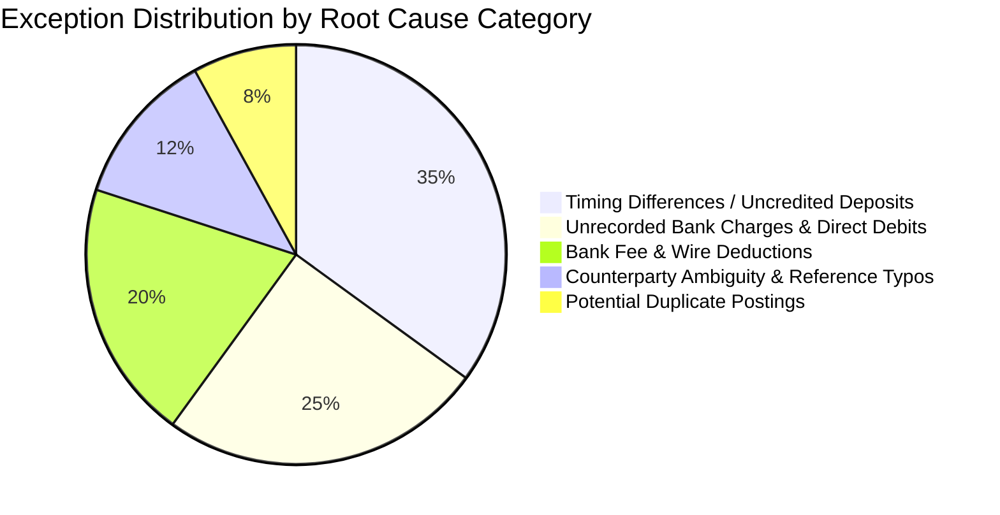
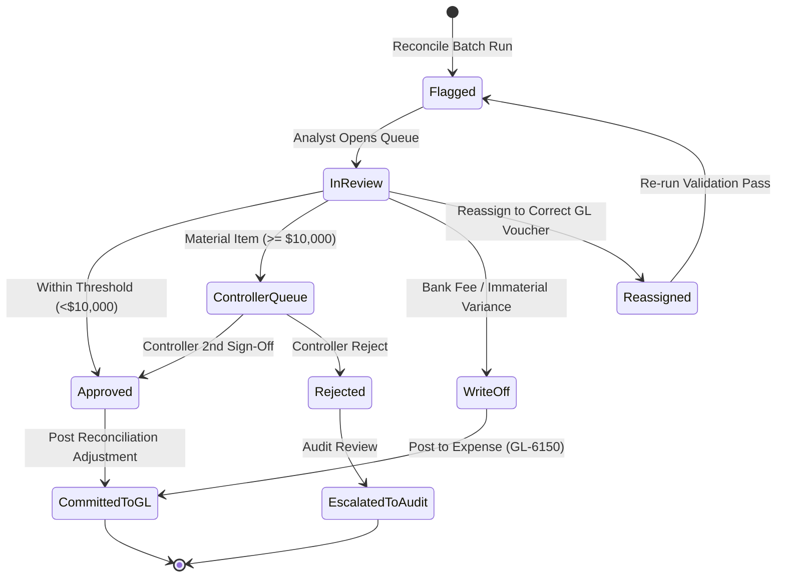
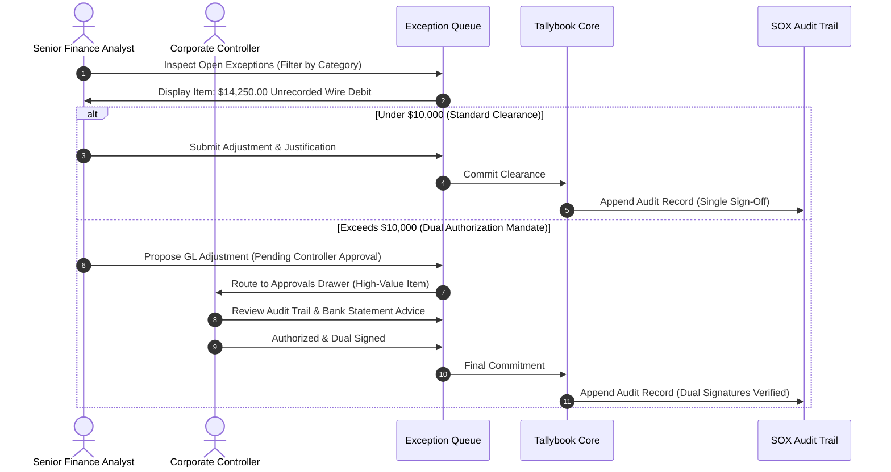

# Exception Triage & Accounting Workflows

## Overview

In enterprise finance, an autonomous agent must never force a false match. Genuine discrepancies (unrecorded debits, bank errors, fraudulent charges, or missing invoices) must be categorized honestly and surfaced with actionable remediation advice.

---

## 1. Exception Taxonomy & Categories

| Exception Category Code | Accounting Label | Root Cause Explanation | Default Recommended Action |
| :--- | :--- | :--- | :--- |
| `TIMING_DIFFERENCE` | Timing Difference / Uncredited Deposit | Deposit initiated at month-end but credit card/merchant processor batch not settled in bank until next period. | Carry forward to next period as a timing reconciliation item. |
| `UNRECORDED_BANK_CHARGE` | Unrecorded Bank Direct Debit | Bank fee, foreign exchange fee, or automated utility debit that exists on the bank statement without a prior GL voucher. | Create new Accounts Payable / Expense voucher in GL with 1-click. |
| `BANK_FEE_VARIANCE` | Bank Fee / Wire Deduction | Intermediate routing bank deducted correspondent charges from international wire. | Post adjusting entry to Bank Charges Expense (GL-6150). |
| `COUNTERPARTY_AMBIGUITY` | Counterparty Reference Ambiguity | Vendor name heavily abbreviated on statement line (e.g. `SVCS-HQ-TX-99`) with multiple possible internal purchase orders. | Route to Accounts Payable analyst for purchase order confirmation. |
| `DUPLICATE_SUSPICION` | Potential Duplicate Payment | Two identical amounts within a 48-hour window from the same vendor. | Flag for immediate Controller review to prevent duplicate cash loss. |

---

## 2. Exception Lifecycle State Machine

---

## 3. Human-in-the-Loop Review Workflow

---

## 4. Remediation Action Definitions

1. **Approve Match (`approve`)**:
   - Manually links the bank statement line to an identified GL voucher, recording the analyst's written justification in the immutable audit trail.
2. **Write-Off Variance (`write_off`)**:
   - Authorizes small balance differences (typically under $50.00) to be cleared directly to the designated variance expense ledger (`GL-6150 Bank Charges & Small Write-Offs`).
3. **Escalate to Controller (`escalate`)**:
   - Flags transactions exceeding $10,000 or suspected fraudulent items into the high-priority Controller queue.
4. **Reassign Voucher (`reassign`)**:
   - Detaches an incorrect ledger candidate and pairs the statement item with the correct voucher number.
