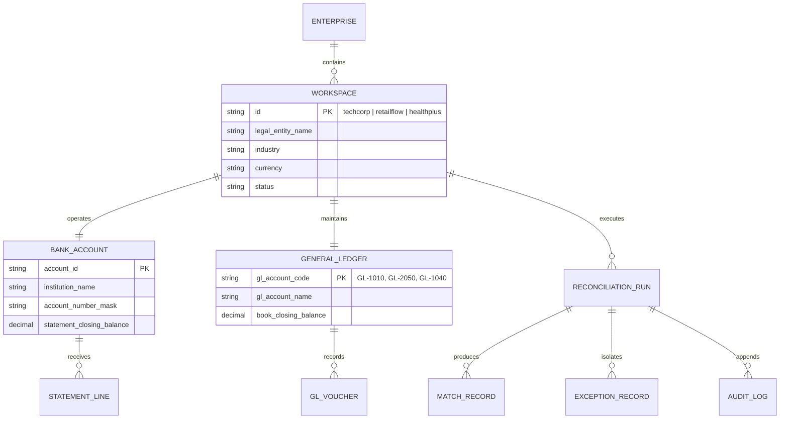
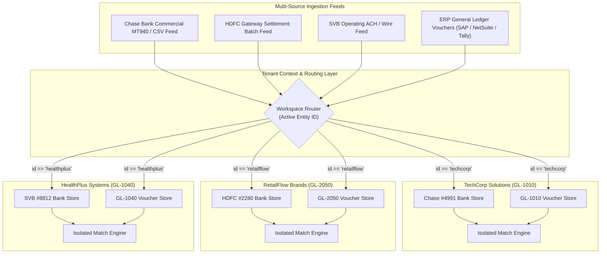

# Multi-Entity Workspaces & Chart of Accounts Routing

## Overview

Modern corporate finance teams manage multi-entity subsidiary structures, each with distinct commercial bank accounts, currencies, general ledger accounts, and regulatory jurisdictions. Tallybook provides an **Excel-style Multi-Business Workspace Switcher** that completely isolates statements, ledger entries, and audit histories across legal entities while offering executive rollup views.

---

## 1. Multi-Entity Data Architecture

---

## 2. Pre-Configured Demo Workspaces

| Workspace ID | Legal Entity Name | Sector | Bank Account | General Ledger Account | Base Currency | Typical Transaction Volume |
| :--- | :--- | :--- | :--- | :--- | :--- | :--- |
| `techcorp` | **TechCorp Solutions Inc.** | Enterprise Software / SaaS | Chase Commercial `#4991` | `GL-1010 Cash & Equivalents` | USD ($) | High volume, subscription receipts, wire payouts |
| `retailflow` | **RetailFlow Brands Ltd.** | E-Commerce / Consumer Retail | HDFC Current `#2280` | `GL-2050 Clearing Account` | USD / INR | High frequency, payment gateway settlement batches |
| `healthplus` | **HealthPlus Systems Inc.** | Healthcare / Medical Diagnostics | SVB Operating `#8812` | `GL-1040 Operating Account` | USD ($) | Material disbursements, insurance claims, strict audit |

---

## 3. Statement-to-Ledger Routing Pipeline

---

## 4. UI Workspace Switching Mechanics

When switching between workspaces in the left navigation sidebar:
1. **Context Update**: `WorkspaceContext` immediately sets `activeWorkspace`.
2. **Dynamic Breadcrumb**: The Mac toolbar breadcrumb updates in real time (e.g., `TechCorp · Chase Commercial #4991 → GL-1010`).
3. **KPI & Dataset Re-binding**: Dashboard tiles, Balance Alignment strips, and Analytics recalculate instantaneously without page reloads.
4. **Audit Scope Isolation**: Audit trail logs filter strictly by the selected business entity, preventing cross-subsidiary data contamination during compliance audits.
