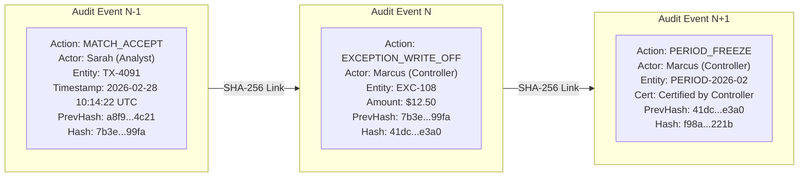
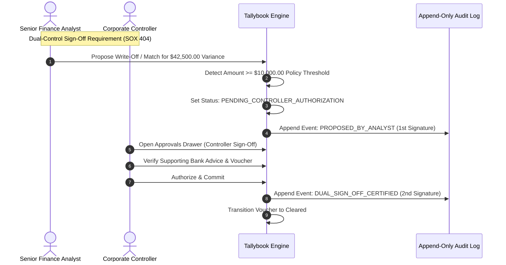
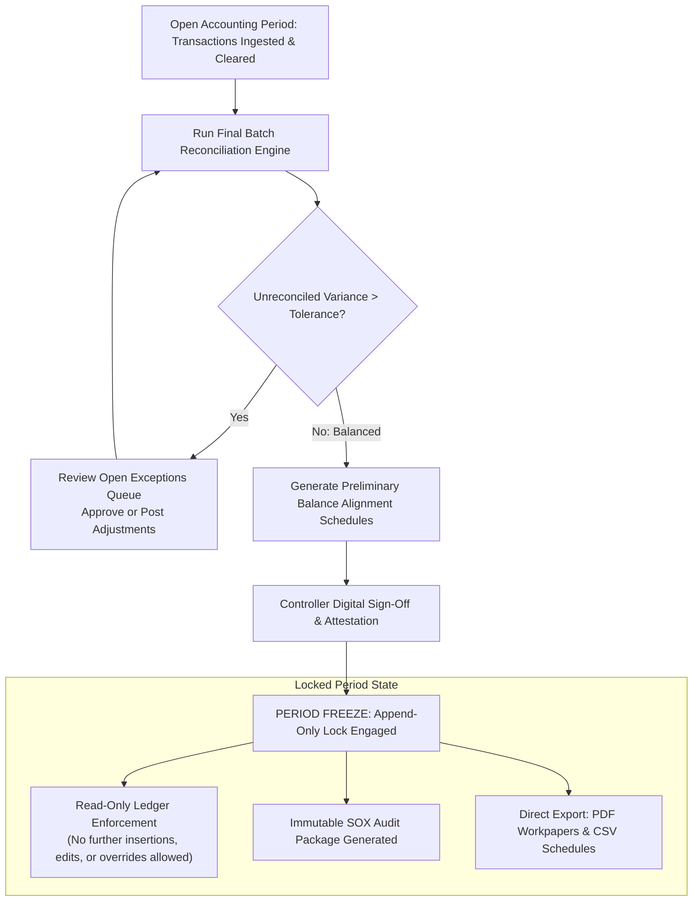

# SOX Compliance, Cryptographic Audit Trail & Period Certification

## Overview

Sarbanes-Oxley (SOX) Section 404 and global statutory accounting standards require complete evidentiary certainty over all internal financial controls and general ledger balances. Tallybook enforces an **append-only immutable audit trail with SHA-256 cryptographic hash chaining** and dual-authorization approval workflows.

---

## 1. Cryptographic Hash-Chained Audit Model

Every transaction clearance, manual override, exception write-off, and policy adjustment generates an immutable audit record. Each record computes a cryptographically linked SHA-256 digest referencing the hash of the preceding event, creating a tamper-evident audit ledger.

### Forensic Hash Verification Formula:
$$
H_n = \text{SHA256}\left(H_{n-1} \parallel \text{Timestamp} \parallel \text{ActorRole} \parallel \text{Action} \parallel \text{EntityId} \parallel \text{StateDelta}\right)
$$
If any historical record is modified or deleted in the datastore, the hash chain breaks immediately, alerting the Statutory Auditor in the Audit Trail Health Index (`Hash Chain: Tampered (Compromised)`).

---

## 2. Four-Eye Dual Authorization Principle

For material transactions exceeding corporate risk cutoffs (default: **$10,000.00 USD**):

---

## 3. Period Close, Freeze & Certification Lifecycle

At the end of each accounting cycle (monthly or quarterly), the Corporate Controller executes the statutory period freeze:

---

## 4. Auditor Capabilities (Elena - Deloitte Statutory Auditor)

Auditors have independent read-only credentials with exclusive governance tools:
1. **Cryptographic Verification**: 1-click verification of the entire SHA-256 hash sequence across all batches.
2. **Interactive Forensic Event Inspector**: Click any historical event in the timeline to view the exact before-and-after voucher state JSON diff.
3. **Statutory Export Packages**: One-click download of the complete audit log, reconciliation report, and certification statement for regulatory submission.
