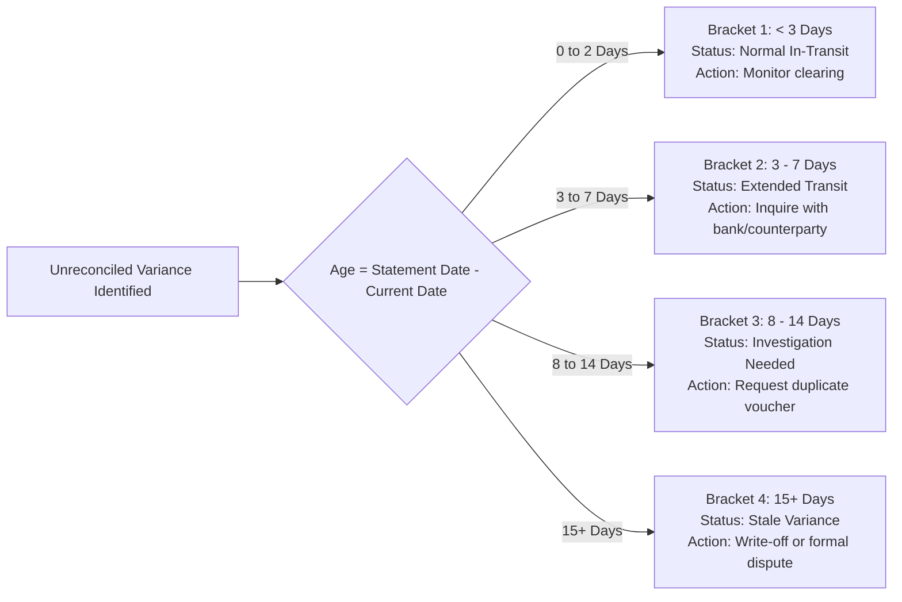

# Financial Analytics, Quality Metrics & Cash Positioning

## Overview

Traditional machine-learning metrics (like raw loss functions, hyperparameter embeddings, or uncalibrated confidence curves) provide little actionable insight to corporate accounting teams. Tallybook translates financial operations into **verifiable controller analytics**: net cash velocity, clearance accuracy, aging of open differences, and counterparty exposure concentrations.

---

## 1. Controller Metrics Taxonomy Tree

```mermaid
graph TD
    ROOT[Corporate Financial Analytics] --> M1[Reconciliation Quality Metrics]
    ROOT --> M2[Cash Positioning & Velocity]
    ROOT --> M3[Variance Aging & Risk]

    M1 --> M1A["Reconciliation Rate (% Cleared)"]
    M1 --> M1B["Clearance Accuracy (Verified Non-False Matches)"]
    M1 --> M1C["Match Coverage (% Eligible Items Matched)"]
    M1 --> M1D["Reconciliation Quality Index (Harmonic Balance)"]

    M2 --> M2A["Total Cleared Inflows (Customer Receipts)"]
    M2 --> M2B["Total Cleared Outflows (Disbursements)"]
    M2 --> M2C["Net Cleared Cash (Operating Position)"]
    M2 --> M2D["Daily Clearance Velocity Trend"]

    M3 --> M3A["Aging Bracket: < 3 Days (Fresh Differences)"]
    M3 --> M3B["Aging Bracket: 3 - 7 Days (Standard Transit)"]
    M3 --> M3C["Aging Bracket: 8 - 14 Days (Investigation Required)"]
    M3 --> M3D["Aging Bracket: 15+ Days (High-Risk Stale Items)"]
    M3 --> M3E["Counterparty Exposure Ranking"]
```

---

## 2. Metric Definitions & Finance Translation Matrix

| Developer / Data Science Term | Accounting Controller Standard | Formula / Measurement | Interpretation for Controller |
| :--- | :--- | :--- | :--- |
| `Precision` | **Clearance Accuracy** | $\frac{TP}{TP + FP}$ | Measures freedom from false clearances. A 97.2% accuracy means <3% risk of an improper voucher link. |
| `Recall` | **Match Coverage** | $\frac{TP}{TP + FN}$ | Measures exhaustive clearance. A 100% coverage confirms zero eligible vouchers were overlooked. |
| `F1 Score` | **Reconciliation Quality Score** | $2 \cdot \frac{\text{Accuracy} \cdot \text{Coverage}}{\text{Accuracy} + \text{Coverage}}$ | Composite audit index balancing accuracy and automation volume. |
| `Confidence Delta` | **Calibration Delta** | $\|\text{Confidence} - \text{Accuracy}\|$ | Ensures system confidence aligns with actual clearance accuracy (never overconfident). |
| `Throughput` | **Transaction Velocity** | $\text{Records} / \text{Second}$ | Engine clearing speed (typically >500 transactions per second). |

---

## 3. Aging of Differences Pipeline

Unreconciled variances are classified into four standard operational aging buckets:

---

## 4. Counterparty Exposure Concentration

Corporate controllers must prevent localized counterparty disputes from accumulating. Tallybook aggregates all open variances across vendors and customers:

- **Top Counterparty Exposures**: Displays the top 5 counterparties with unreconciled balances.
- **Exposure Cap Alerts**: Flags if any single counterparty represents more than 25% of total open variance.
- **Automated Communication Templates**: 1-click generation of bank inquiry emails or vendor payment verification letters.
