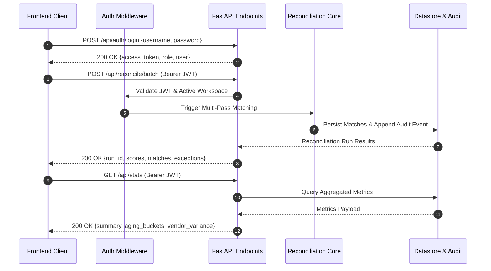

# REST API Specification — Tallybook Backend Service

## Overview

The Tallybook API is built with **FastAPI** to deliver asynchronous, low-latency endpoints for automated bank reconciliation, ledger voucher management, exception resolution, and cryptographic audit trail querying.

- **Base URL**: `http://127.0.0.1:8000/api`
- **Interactive Swagger Docs**: `http://127.0.0.1:8000/docs`
- **Format**: JSON (`Content-Type: application/json`)

---

## 1. Client-Server Interaction Sequence



---

## 2. Core Endpoint Reference

### 2.1 Authentication & Session

#### `POST /api/auth/login`
Authenticates a user and returns a signed JWT bearer token.
- **Request Body**:
  ```json
  {
    "username": "controller",
    "password": "controller123"
  }
  ```
- **Response `200 OK`**:
  ```json
  {
    "access_token": "eyJhbGciOiJIUzI1NiIsInR5cCI6IkpXVCJ9...",
    "token_type": "bearer",
    "user": {
      "id": "usr-ctrl-01",
      "username": "controller",
      "role": "controller",
      "email": "marcus.vance@enterprise-cfo.com"
    }
  }
  ```

---

### 2.2 Autonomous Reconciliation

#### `POST /api/reconcile/batch`
Executes the full 3-tier reconciliation engine across bank statement lines and general ledger vouchers.
- **Query Parameters**:
  - `workspace_id` (optional string): Target business entity (default: active workspace).
  - `accept_threshold` (optional float): Confidence cutoff (default: `0.80`).
- **Response `200 OK`**:
  ```json
  {
    "run_id": "RUN-20260228-091244",
    "timestamp": "2026-02-28T09:12:44.182Z",
    "scores": {
      "claimed_match_rate_pct": 94.67,
      "verified_precision_pct": 97.18,
      "recall_pct": 100.0,
      "f1_score_pct": 98.57,
      "calibration_delta": 0.007
    },
    "matches": [...],
    "exceptions": [...]
  }
  ```

---

### 2.3 Match Management & Analyst Overrides

#### `GET /api/matches`
Lists all cleared matches for the current or specified reconciliation run.
- **Query Parameters**: `run_id` (string), `status` (string), `rule_name` (string).

#### `POST /api/matches/{match_id}/override`
Allows an authorized Analyst or Controller to manually override a matched record.
- **Request Body**:
  ```json
  {
    "action": "accept",
    "override_reason": "Confirmed split payment with vendor accounts department."
  }
  ```

---

### 2.4 Exception Triage & Approvals

#### `GET /api/exceptions`
Retrieves all open unreconciled exceptions.
- **Query Parameters**: `category` (string), `severity` (string), `min_amount` (float).

#### `POST /api/exceptions/{exception_id}/approve`
Authorizes an exception remediation action.
- **Request Body**:
  ```json
  {
    "action": "write_off",
    "notes": "Small correspondent bank wire fee within $15 tolerance."
  }
  ```

---

### 2.5 Audit Trail & SOX Querying

#### `GET /api/audit`
Returns the append-only chronological audit log.
- **Query Parameters**:
  - `entity_type` (string): `match | exception | period | rule`
  - `actor_role` (string): `controller | analyst | auditor | system`
  - `action` (string): Action filter code
- **Response `200 OK`**:
  ```json
  [
    {
      "id": "AUDIT-2026-00412",
      "timestamp": "2026-02-28T09:15:32Z",
      "actor_name": "Marcus Vance",
      "actor_role": "controller",
      "action": "PERIOD_CLOSE_CERTIFY",
      "entity_id": "PERIOD-2026-02",
      "notes": "Certified and locked by Corporate Controller.",
      "before_state": { "status": "OPEN" },
      "after_state": { "status": "LOCKED" },
      "hash": "e3b0c44298fc1c149afbf4c8996fb92427ae41e4649b934ca495991b7852b855"
    }
  ]
  ```

---

### 2.6 Financial Analytics & Export

- `GET /api/stats`: Comprehensive statistics payload (aging, cash flow, accuracy).
- `GET /api/data/export/csv/{run_id}`: Streamed CSV download of the reconciliation batch.
- `GET /api/data/export/pdf/{run_id}`: Certified PDF statutory audit schedule.
- `GET /api/health`: Health status, datastore latency, and version check.

---

### 2.7 Multilingual AI Finance Controller

#### `GET /api/assistant/briefing`
Generates a structured executive treasury summary translated across **8 native languages**.
- **Query Parameters**:
  - `lang` (string, optional): Target language code (`en`, `es`, `fr`, `de`, `ja`, `zh`, `pt`, `hi`). Default: `en`.
- **Response `200 OK`**:
  ```json
  {
    "language": "es",
    "language_name": "Español",
    "headline": "Resumen Ejecutivo de Conciliación",
    "summary_markdown": "- **Tasa de Conciliación**: 98.4%\n- **Volumen Verificado**: $1,420,500.00...",
    "metrics": {
      "clearance_rate": 98.4,
      "reconciled_volume": 1420500.0,
      "open_variances_count": 10
    }
  }
  ```

#### `POST /api/assistant/chat`
Real-time financial copilot inquiry endpoint answering questions on GL balance variances, counterparty exposure, and audit status.
- **Request Body**:
  ```json
  {
    "message": "Why was the Chase wire fee flagged?",
    "lang": "en"
  }
  ```
- **Response `200 OK`**:
  ```json
  {
    "reply": "The $15.00 wire fee variance exceeded the automated clearance tolerance ($1.00 threshold) and was routed to the Controller review queue."
  }
  ```
