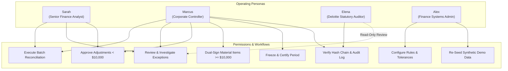
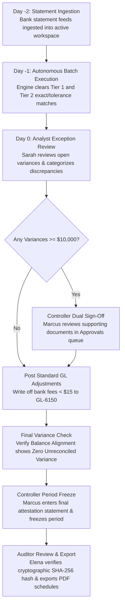

# Operations Guide & User Personas Runbook

## Overview

Tallybook is architected around four distinct finance operating personas. Each persona has tailored permissions, distinct navigational views, and specialized actions that uphold internal accounting segregation of duties.

---

## 1. Role-Based Access Control (RBAC) Matrix

| Operating Persona | Username / Password | Primary Daily Responsibilities | Allowed Actions | Restricted Actions |
| :--- | :--- | :--- | :--- | :--- |
| **Finance Analyst** | `analyst` / `analyst123` | Daily batch clearing, investigating unmatched statement lines, gathering counterparty invoice advice. | Run batch, propose overrides, approve small variances (<$10k). | Cannot freeze accounting periods; cannot sign off material items (≥$10k). |
| **Corporate Controller** | `controller` / `controller123` | Balance alignment oversight, high-value authorization, period close certification. | Full operational approval, dual sign-off, period lock, policy enforcement. | Cannot modify historical logs after period lock. |
| **Statutory Auditor** | `auditor` / `auditor123` | Independent SOX compliance audit, hash chain validation, workpaper verification. | Read-only forensic inspection, hash chain verify, export certified PDF audit packages. | Cannot create, modify, or delete financial records. |
| **Systems Admin** | `admin` / `admin123` | Platform health, multi-entity setup, rule parameter configuration, dataset reseeding. | Tune rule parameters, manage thresholds, re-seed demo benchmarks. | Segregated from day-to-day transaction approvals. |

---

## 2. Standard Month-End Closing Runbook

---

## 3. Step-by-Step Operator Instructions

### How to Reconcile a New Financial Batch
1. Log in as **Analyst** or **Controller**.
2. Select your target subsidiary from the **Workspace Switcher** in the sidebar (e.g., *TechCorp Solutions*).
3. Click the **Run Reconcile** button in the top window toolbar (or press `⌘R`).
4. Watch the progress indicator as Tier 1, Tier 2, and Tier 3 rules execute across all statement items.
5. Review the updated **Balance Alignment** card on the Overview dashboard to confirm cleared volume.

### How to Resolve an Open Exception
1. Navigate to **Reconciliation** in the sidebar and switch to the **Exceptions** tab.
2. Select an exception card (e.g., *Unrecorded Wire Fee*).
3. Review the AI explainability trace, confidence score, and candidate ledger entries.
4. Choose an action:
   - Click **Approve** if matching to an identified ledger voucher.
   - Click **Write-Off** to allocate to bank charges (`GL-6150`).
   - Click **Escalate** if the item requires investigation by the corporate controller.
5. Enter your audit justification note and click **Confirm**.

### How to Perform Period Close & Statutory Certification
1. Ensure all open exceptions for the current period have been resolved or authorized.
2. Navigate to **Period Close** under the Governance navigation group.
3. Verify that the **Integrity Score** reads `100/100` and **Hash Chain** shows `Verified`.
4. Enter your certification attestation statement (e.g., *"Audited and certified by Corporate Controller"*).
5. Click **Certify & Freeze Period**. The period becomes immutable and locked.
6. Click **Export Audit Package (PDF)** to download the certified statutory workpapers.
