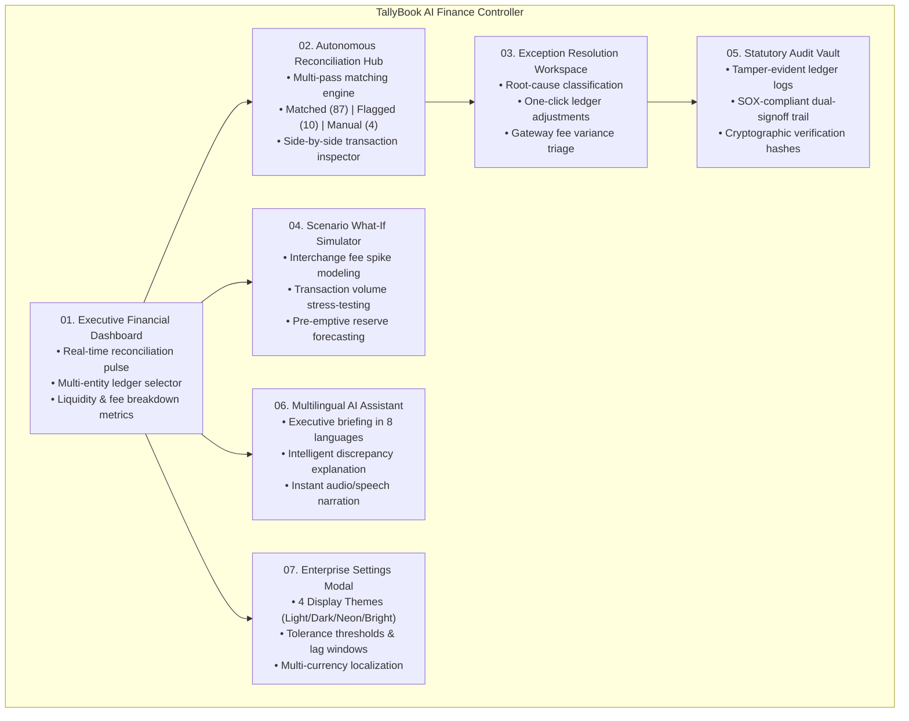
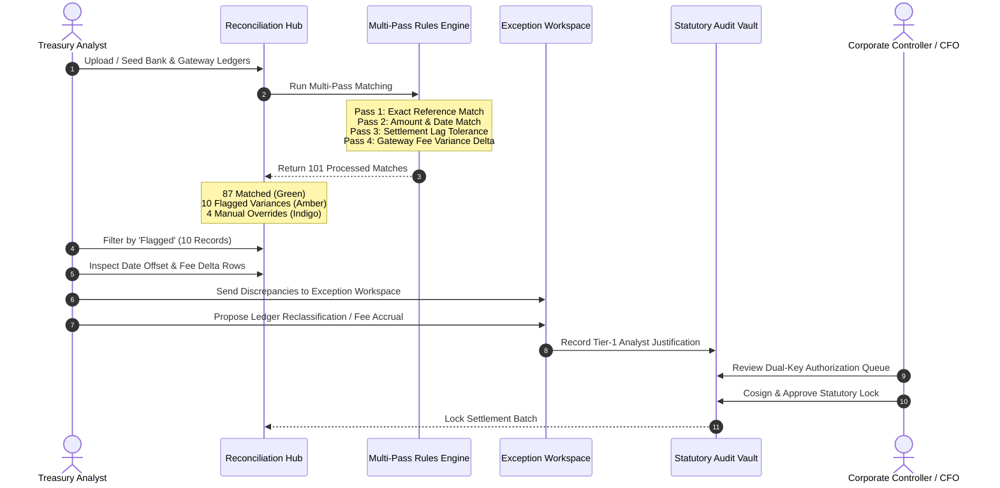
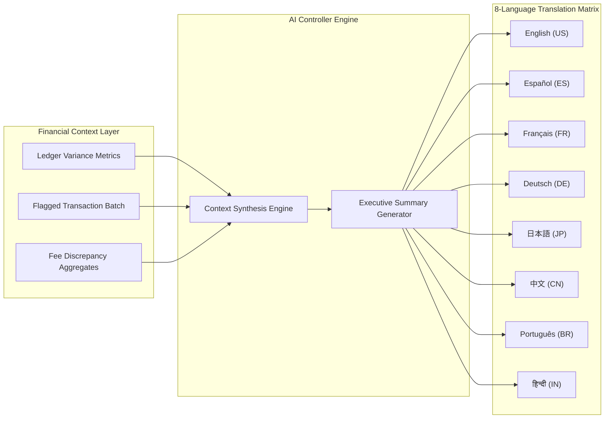
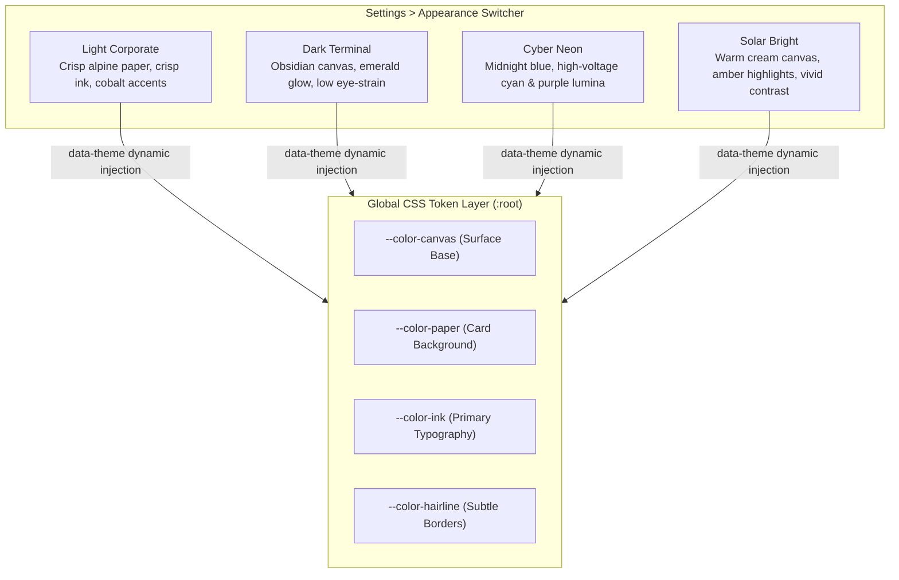

# TallyBook AI Finance Controller — Interactive Feature & Exploration Guide

Welcome to the **TallyBook AI Finance Controller** comprehensive evaluation guide. This document provides a complete walkthrough of all system capabilities, workflows, and interactive features designed for CFOs, corporate controllers, internal auditors, and treasury managers.

> 🎙️ **Watch Official Pitch Presentation (Google Drive)**:  
> *Please watch in 1080p :)*  
> **[https://drive.google.com/file/d/1kAE0XRpmEkOI77T2RNU4CeSxmMeGFFkh/view?usp=sharing](https://drive.google.com/file/d/1kAE0XRpmEkOI77T2RNU4CeSxmMeGFFkh/view?usp=sharing)**  
> 📁 *Local GitHub Repo MP4: [`docs/TallyBook_Pitch.mp4`](TallyBook_Pitch.mp4) | Slide Deck: [`docs/TallyBook_Pitch_Deck.pdf`](TallyBook_Pitch_Deck.pdf)*  
>
> 🎬 **Watch Full Product Demonstration (Google Drive)**:  
> *Please watch in 1080p :)*  
> **[https://drive.google.com/file/d/1qkDbucXDn-RKV5QnvdGEFyFZg4kxoVX6/view?usp=sharing](https://drive.google.com/file/d/1qkDbucXDn-RKV5QnvdGEFyFZg4kxoVX6/view?usp=sharing)**  
> *1080p full product tour covering multi-pass matching, flagged exception handling, what-if stress simulation, 4 dynamic theme modes, and multilingual AI assistant briefings.*

> 📋 **AI Tools & Development Architecture**:  
> For the complete audit of AI tools utilized during development, engineering challenges, and HackerGPT security scans, see [AI_USAGE_AND_DEVELOPMENT_LOG.md](AI_USAGE_AND_DEVELOPMENT_LOG.md).

---

## 1. System Capability & Navigation Map

---

## 2. Autonomous Reconciliation & Triage Workflow

---

## 3. Multilingual AI Finance Controller Architecture

---

## 4. Theme & Visual Personalization Architecture

---

## 5. Step-by-Step Feature Exploration Guide

Follow these sequential steps to test every feature of the live application:

### Step 1: Launch & Verify Server Status
1. **Frontend**: Open `http://localhost:5173` in your browser.
2. **Backend API**: Open `http://127.0.0.1:8000/docs` to inspect real-time interactive OpenAPI endpoints.
3. The platform boots directly into the **Executive Financial Dashboard** inside the native Mac-styled application frame.

---

### Step 2: Test 4 Interactive Theme Modes & Enterprise Settings
1. Click the **Settings** button in the top window toolbar (or in the bottom sidebar profile card).
2. The **Enterprise Settings & Preferences** modal will open with four tabs:
   - **Appearance**: Click on each of the 4 theme preview cards:
     - **Light Corporate**: Clean, institutional aesthetic with soft elevation.
     - **Dark Terminal**: Sleek obsidian canvas with emerald and amber readouts.
     - **Cyber Neon**: Deep blue-indigo background with radiant cyan and violet borders.
     - **Solar Bright**: High-energy warm cream canvas with rich golden accents.
   - **Matching Tolerances**: Test adjusting the sliders:
     - *Minimum Confidence Score Threshold* (80% - 99%)
     - *Maximum Settlement Lag Window* (0 - 7 business days)
     - *Gateway Fee Variance Tolerance* ($0.00 - $10.00)
   - **Localization**: Change the primary reporting currency between **USD ($)**, **EUR (€)**, **GBP (£)**, and **INR (₹)**, or toggle date formats (`YYYY-MM-DD`, `DD/MM/YYYY`, `MM/DD/YYYY`).
   - **Governance & Policy**: Adjust the dual sign-off escalation cutoff (e.g., $10,000) and toggle automatic statutory ledger freeze upon sign-off.
3. Click **Apply & Save Configuration** to apply your preferences globally.

---

### Step 3: Explore the Autonomous Reconciliation Hub & Synthetic Data
1. Navigate to **Reconciliation** via the left sidebar.
2. Observe the match summary pill counters:
   - **All Records (101)**: Comprehensive view of all processed transactions.
   - **Matched (87)**: Clean, high-confidence automated matches with green status badges.
   - **Flagged (10)**: Click this filter tab to inspect synthetic flagged exceptions:
     - Includes transactions with **Gateway Fee Variances** (e.g., unexpected $3.50 or $4.50 fee deductions).
     - Includes transactions with **Settlement Date Offsets** (lag >= 2 business days).
     - Notice the amber badge marked **FLAGGED REVIEW** and the specific variance audit reason.
   - **Manual (4)**: Click this filter tab to inspect synthetic analyst manual overrides:
     - Displays historical transactions that were approved via human sign-off (e.g., multi-currency FX fee absorption, batch settlement consolidation).
     - Notice the indigo badge marked **MANUAL OVERRIDE** with analyst sign-off tags.
3. Click on any transaction row to open the **Transaction Details Drawer**:
   - Compare the **Internal General Ledger** record on the left against the **External Gateway Statement** on the right.
   - Review the calculated confidence score and rule breakdown.
4. Click **Run Reconciliation Pipeline** in the top-right header to re-run live multi-pass matching with animated feedback.

---

### Step 4: Exception Resolution Workspace
1. Navigate to **Exceptions** in the sidebar.
2. Review categorized financial breaks:
   - *Gateway Fee Creep*
   - *Cross-Border FX Rounding Discrepancies*
   - *Unmatched Payout Batches*
3. Select an exception to review the suggested resolution:
   - *Auto-reclassify fee to Account 6210 (Merchant Processing Expenses)*.
   - *Accrue FX variance to Currency Translation Reserve*.
4. Click **Apply Resolution** to execute the correction and emit an immutable audit log.

---

### Step 5: Scenario What-If Simulator
1. Navigate to **What-If Simulation** in the sidebar.
2. Use the interactive scenario sliders:
   - **Interchange Fee Adjustment**: Increase gateway fees by +0.35% to project gross margin degradation over the next quarter.
   - **Transaction Volume Spike**: Simulate a 250% holiday volume surge to test exception rate scaling.
   - **FX Volatility Factor**: Stress-test non-USD transactions against a 5% currency swing.
3. Click **Run Stress Simulation** to observe dynamic charts updating with forecasted variances, recommended cash buffer reserves, and risk ratings.

---

### Step 6: Multilingual AI Finance Controller
1. Open the AI Assistant drawer anytime by clicking the **AI Controller** button on the top right or pressing `Ctrl + Space`.
2. Notice the **Language Selector Bar** across the top of the AI drawer:
   - **EN** (English) | **ES** (Español) | **FR** (Français) | **DE** (Deutsch)
   - **JA** (日本語) | **ZH** (中文) | **PT** (Português) | **HI** (हिन्दी)
3. Click any language pill (e.g., **ES**, **FR**, **JA**, or **HI**):
   - The AI Assistant generates a structured, executive-level financial briefing translated natively into the selected language.
   - The briefing summarizes current settlement health, unallocated variance balances, top exception categories, and recommended next actions.
4. Click the **Audio / Speaker button** next to the briefing to hear speech narration in your chosen language.
5. You can also type custom financial questions into the prompt input (e.g., *"What is the status of our Stripe settlement lag?"*).

---

### Step 7: Statutory Audit Vault & SOX Compliance
1. Navigate to **Audit Trail** in the sidebar.
2. Review the chronological, tamper-evident log of all accounting actions:
   - Automated ingestion runs
   - Rule executions
   - Manual overrides with user identity, timestamp, and justification reason
   - Controller dual-authorization sign-offs
3. Click **Verify Cryptographic Proofs** to run SHA-256 chain integrity verification across all ledger blocks.

---

### Step 8: Multi-Entity Switching
1. Click the entity selector in the top bar:
   - Switch between **US Corp (Main HQ)**, **EU Holdings BV (Amsterdam)**, and **APAC Logistics Ltd (Singapore)**.
   - Notice the dashboard KPIs, settlement volumes, and currency balances adapt to the selected operating company.

---

## 6. Summary of Feature Coverage

| Feature Category | Capabilities Included | Where to Experience |
| :--- | :--- | :--- |
| **Theme System** | 4 Dynamic themes (`Light`, `Dark`, `Neon`, `Bright`), instantaneous CSS token switching, persistent in `localStorage`. | Settings Modal (`Settings` button in Topbar / Sidebar) |
| **Autonomous Matching** | 5-pass rules engine, exact match, tolerance thresholds, fee variance detection, settlement lag analysis. | Reconciliation Hub (`/reconcile`) |
| **Synthetic Exception Data** | 101 total records: 87 Matched, 10 Flagged variances, 4 Manual overrides. | Reconciliation Table Filter Tabs |
| **Exception Triage** | Root-cause classification, dispute tagging, one-click ledger adjustment suggestions. | Exception Workspace (`/exceptions`) |
| **What-If Simulations** | Interchange fee stress-testing, holiday volume surge forecasting, margin impact projections. | Simulation Page (`/simulation`) |
| **Statutory Governance** | SOX dual-authorization, immutable event logs, cryptographic chain verification. | Audit Trail (`/audit`) & Admin Vault (`/admin`) |
| **Multilingual AI Assistant** | 8 languages (EN, ES, FR, DE, JA, ZH, PT, HI), native financial executive briefings, audio narration. | AI Drawer (`Ctrl+Space` or top-right AI button) |
| **Multi-Entity Treasury** | Multi-subsidiary ledger consolidation, currency conversion, entity-specific risk dials. | Topbar Entity Dropdown |

---

*TallyBook AI Finance Controller is engineered for modern financial teams requiring enterprise-grade accuracy, real-time visibility, and strict statutory compliance.*
